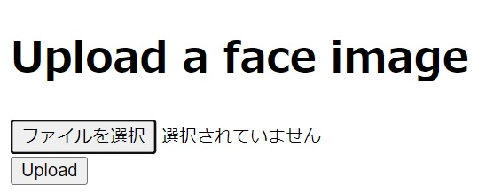

# Face Search
<div align="center">

</div>
<p align="center">
  <a href="https://github.com/yahoojapan/NGT/blob/master/python/README-ngtpy-jp.md"></a>
  <a href="https://github.com/ageitgey/face_recognition"></a>
</p>

## 📋 概要 
[face_recognition](https://github.com/ageitgey/face_recognition) と [ngt](https://github.com/yahoojapan/NGT/blob/master/python/README-ngtpy-jp.md) を利用したそっくりさん検索API

## 🐋 準備
リポジトリをクローンし, ./face_search/data/first_upload_images にディレクトリを作り ID名.jpg の形式で画像を保存. ここにある画像は最初 (docker run) から登録される.
<br>ディレクトリ face_search に移動 Dockerfile より build.
```bash
git clone https://github.com/sojiro-otsubo/face_search.git
# ./face_search/data/first_upload_imagesディレクトリを作る
# ./face_search/data/first_upload_images に画像追加
cd face_search
docker build -t api_test .
```

## 🌐 apiの起動
```bash
docker run --gpus all --name faceAPI -p 5000:5000 -it api_test
👉 http://localhost:5000
```

## 💬 apiの使い方
### ***@predict.route("/", methods=['GET', 'POST'])***

そっくりさんを検索したい人の jpg か png イメージをアップロードすると, そっくり度上位10位のIDが json形式で返される.
<div align="center">

</div>

```
{"result":["000034","000019","000002","000024","000064","000012","000030","000022","000037","000016"],"status":"ok"}
```

### ***@upload.route("/upload", methods=['GET', 'POST'])***
データベースに登録したい人の jpg か png イメージを ID名.jpg の形式でアップロードすると, data/face_db.db, data/index への登録, storageへの画像の保存が行われる.

### ***@status.route('/status')***
死活チェック

## 💯 apiのテスト
```bash
docker run -t api_test python3 -m unittest tests.test_api
```

## 📝 設計
ngtが特有の近傍探索アルゴリズムを利用しているため, indexにはベクトルとそのベクトルを格納した順番しか保存されていない. 検索とメタデータを紐づけるため, indexにベクトルを挿入するのと同時にDBにデータとメタデータを挿入した. 
